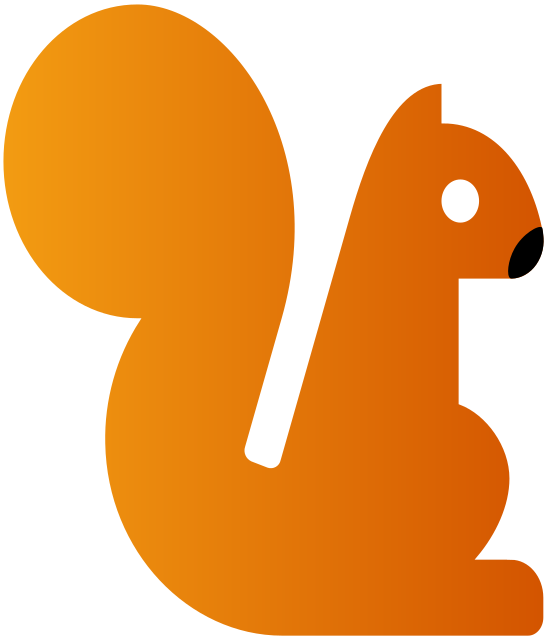

<p align="center">
  <a href="https://mpatate.silvain.eu/">
    
  </a>
</p>

<h1 align="center">Monsieur Patate</h1>
<p align="center">
 <a href="https://drone.silvain.eu/Silvain.eu/MonsieurPatatePhp">
  
 </a>
</p>

Récupération de l'emploi du temps de ADE ULCO (https://edt.univ-littoral.fr/) et gestion des devoirs.

Cette application s'inscrit dans le cadre d'un projet composé de 3 dépôts :
- **MonsieurPatatePhp** : Site web permettant la consultation de l'emploi du temps et la gestion des devoirs. Cette application embarque également les scripts réalisant l'actualisation de l'emploi du temps et l'envoie de notifications lorsque cela est nécessaire.
- [MonsieurPatatePlanning](https://github.com/silvainlud/MonsieurPatatePlanning) : Script JS faisant des captures d'écran de l'emploi du temps fourni par ADE ULCO
- [MonsieurPatateBot](https://github.com/silvainlud/MonsieurPatateBot) : Bot discord pour consulter l'emploi du temps

## Technologie

Ce projet est développé en PHP avec le framework Symfony `6.0`. Pour des raisons d'organisation, ce projet n'utilise pas la hiérarchie de dossiers par défaut : 
- `src/Http` : contient l'ensemble des éléments qui concerne directement la couche Http (ex : Controller)
- `src/Domain/{name}` : correspond à la logique métier (Entity, Repository, Fomulaire liè à une Entity, ...).
- `src/Infrastrcuture/{name}` : cela définit les éléments de l'infrastructure (ex : envoie de notification Push ou Discord, ... )

Cette organisation est inspirée : [https://grafikart.fr/blog/structure-code-symfony](https://grafikart.fr/blog/structure-code-symfony).


## Fonctionnalités

- Consulter les captures d'écran de l'emploi du temps et importation des nouvelles
- Gestion des devoirs avec système de rappel
- Notification Discord et WebPush
- Application PWA
- Récupération et analyse du fichier ICal fourni par l'université du Littoral Côte d'Opale avec notification en cas de changement


## Installation de l'environnement de développement

### Pré-requis

Pour démarrer l'environnement, vous devez avoir les outils suivants :
- [Docker](https://docs.docker.com/compose/)
- [Docker Compose](https://docs.docker.com/)

### Instruction

Pour lancer l'application, il suffit d'utiliser le fichier de configuration de Docker Compose (à la racine du projet) :

```bash
make dev
```
Il faut alors configurer l'application, pour cela, il suffit de créer un fichier `.env.local` en se basant sur le fichier `.env`.

Une fois le site web configuré, il faut créer la base de données : 

```bash
make cmd # pour se connecter au containeur PHP
php bin/console doctrine:database:create # création de la base de données
php bin/console doctrine:migration:migrate --allow-no-migration -n # application des migrations sur la base de données
```

L'application est alors accessible à l'adresse  : http://localhost:8000


## Déploiement

Ce projet est déployé automatiquement par un service [Drone.Io](https://www.drone.io/) à l'adresse [mpatate.silvain.eu](https://mpatate.silvain.eu/). 
Pour cela, j'utilise notamment Ansible avec [ansistrano](https://github.com/ansistrano/deploy) pour automatiser cette tâche : [/tools/ansible/deploy/deploy.yml](https://github.com/silvain-eu/MonsieurPatatePhp/tree/main/tools/ansible/deploy).

L'objectif de cette automatisation est de lancer les conteneurs :
 - Image PHP avec les fichiers de l'application
 - Nginx avec les fichiers statiques de l'application
 - Redis pour le cache
 - Mysql pour la base de données

## Licence

Ce projet est sous la licence [GNU General Public License v3.0](LICENSE) - voir le fichier  [LICENSE](LICENSE) pour les détails.
